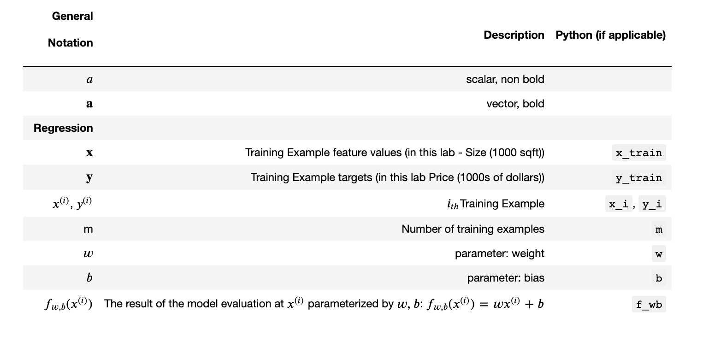
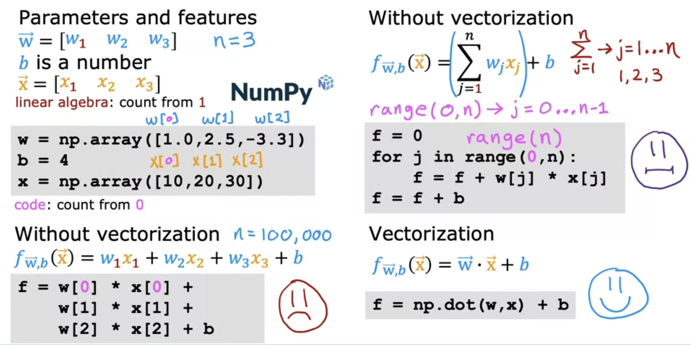

# 회귀 Regression

주어진 입력 변수와 출력 변수 간의 관계를 모델링하여 연속적인 출력값을 예측하는 분석 방법

### 예시


</br>

## 선형 회귀 (Linear Regression)

주어진 입력 변수와 출력 변수 간의 선형 관계를 모델링

### 예시

주어진 주택 크기와 주택 가격 데이터를 통해 선형 관계를 모델링하여 원하는 주택 크기에 해당하는 주택 가격을 예측 

<br/>

<br/>

<br/>

</br>

### 표기법 (Terminology)

<br/>

</br>

### 선형 회귀를 통한 지도 학습 과정

</br>

1. 입력값(Features)과 출력값(Targets)이 포함된 훈련 예제(Training Set)를 통해 모델 생성

2. 모델은 입력값을 받아 예측값($ŷ$)을 출력

</br>

### 모델 f를 표현하는 방법

</br>

### 비용 함수
: 모델의 예측값과 실제 관찰값(또는 레이블) 간의 차이 또는 오차($y$, $ŷ$ 간의 차이)를 측정하는 함수

</br>

$f(x) = wx+b$ 의 $w$, $b$ : 모델의 매개 변수(계수, 가중치)

> 매개 변수 : 모델의 개선을 위해 조정할 수 있는 변수

- 직선이 훈련 데이터에 잘 맞도록 $w$, $b$의 값 조정

- 비용 함수를 통해 직선이 훈련 데이터에 얼마나 잘 맞는지 측정

- 선형 회귀의 경우 일반적으로 제곱 오차 비용 함수 사용

#### 제곱 오차 비용 함수


</br>

</br>

***비용 함수 $J$의 최소값을 구하는 것이 선형 회귀의 목표***

</br>

### 경사 하강법
: 비용 함수 $J$의 (국소)최소값을 구하기 위한 알고리즘

1. 모델의 파라미터 초기화

2. 알고리즘이 수렴할 때까지 비용 함수를 최소화하는 방향으로 비용 함수의 기울기(경사)를 따라 파라미터 값 조정


</br>

</br>
- $w$, $b$를 동시에 조정

#### $J$의 도함수 (편도함수)
</br>
- 학습률은 항상 양수

- 기울기가 양수일 경우 매 업데이트마다 파라미터 감소 ($w - 양수 × 양수$)

- 음수일 경우 매 업데이트마다 파라미터 증가 ($w - 양수 × 음수$)

- 위 과정 반복하며 $J$의 최소값에 근접 (수렴)


#### 학습률 (alpha)
: 각 반복마다 모델 파라미터를 얼마나 크게 조정할 지 결정

- 학습률이 너무 작으면?
    - 매우 많은 조정 단계가 필요하므로 학습 속도 매우 느려짐

- 너무 크면?
    - 수렴하지 못하고 발산할 가능성 존재

#### 고정된 학습률로도 (국소)최소값에 도달할 수 있는 이유
</br>
- 최소값에 가까워질수록 기울기(도함수)가 작아지기 때문


### 표현식

- 편도 함수</br>

    </br>

- 경사 하강법</br>

    </br>

- 선형 회귀</br>

    </br>

</br>

## 다중 특징 (Multiple Features)

- 단일 특징</br>
</br>

- 다중 특징</br>
</br>

### 다중 특징 표기
</br>

</br>

>dot product : 내적

***다중 선형 회귀*** : 다중 특징 선형 회귀

</br>

### 다중 특징 경사 하강법
</br>

</br>

## 벡터화

</br>
- 인덱스가 0부터 시작하는 Python 배열 대신 1부터 시작하는 NumPy 배열 사용
- ```np.dot()``` : dot product 구현

### 벡터화로 구현한 경사 하강법
</br>

## 특성 스케일링 (Feature Scaling)

데이터의 특성(feature)들의 범위를 동일하게 조정

### 특성 스케일링을 하는 이유

- 학습 알고리즘의 성능 향상
    - 특성들의 범위가 다르면 특성의 범위가 큰 특성이 학습 알고리즘에 더 큰 영향
    - 모든 특성이 동일한 비중으로 학습에 참여하도록 하여 알고리즘의 성능 향상

- 이상치의 영향 최소화
    - 이상치가 있는 특성은 다른 특성에 비해 매우 큰 값
    - 이 경우, 이상치가 학습 알고리즘의 학습에 큰 영향

- 비교의 용이성
    - 서로 다른 데이터 세트의 특성들 비교 용이

### 특성 스케일링을 하는 대표적인 방법

- 표준화 (Standardization)

    - 특성들의 평균을 0, 분산을 1로 변환

        <pre>x_std = (x - mu) / sigma</pre>
        - ```x_std``` : 표준화된 특성 값
        - ```x``` : 원본 특성 값
        - ```mu``` : 특성의 평균
        - ```sigma``` : 특성의 분산

</br>

- 정규화 (Normalization)

    - 특성들을 0과 1 사이의 범위로 변환

        <pre>x_norm = (x - min) / (max - min)</pre>
        - ```x_norm``` : 정규화된 특성 값
        - ```x``` : 원본 특성 값
        - ```min``` : 특성의 최소값
        - ```max``` : 특성의 최대값

</br>

- Min-Max 

    - 특성들을 최소값과 최대값 사이의 범위로 변환

        <pre>x_minmax = (x - min) / (max - min)</pre>
        - ```x_minmax``` : Min-max 방법으로 변환된 특성 값
        - ```x``` : 원본 특성 값
        - ```min``` : 특성의 최소값
        - ```max``` : 특성의 최대값

</br>

- Robust Scaler

    - 이상치에 영향을 받지 않는 스케일링 방법

        <pre>x_robust = (x - median) / iqr</pre>
        - ```x_robust``` : RobustScaler로 변환된 특성 값
        - ```x``` : 원본 특성 값
        - ```median``` : 특성의 중간값
        - ```iqr``` : 특성의 제 3사분위값과 제 1사분위값의 차이